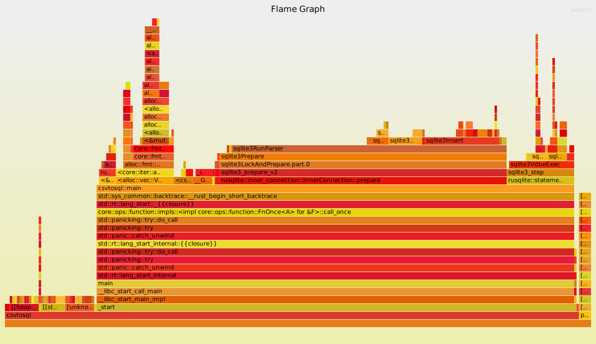
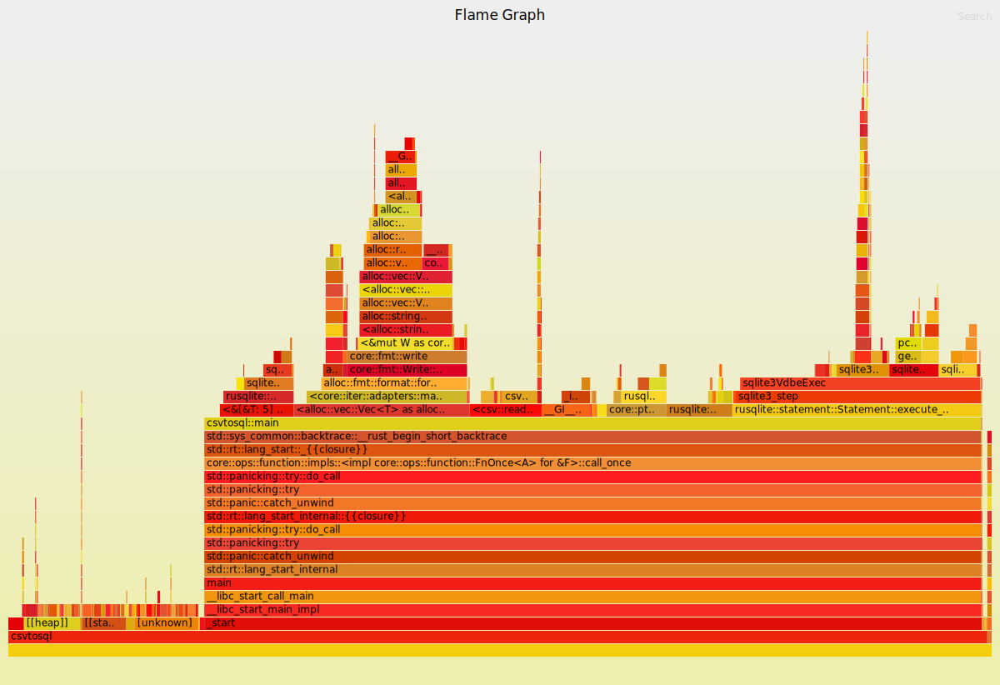

# kilometre
This repo has absolutely nothing to do with units of measurements.

## Running the Binaries
For many if not all of these, I have been using reading from stdin. Example: `cargo run < testfile.csv`

## Generate Test Files

Use `yes` to generate some nice test files. Could go with something like:
```shell
echo "header,columns,go,here" > testfile
yes 'repeated,values,4,rows' | head -n 1000 >> testfile
```

## Generate flamegraph to compare SQLite
rusqlite has `prepare` and `prepare_cached` options. I tried to use [cargo-flamegraph](https://github.com/flamegraph-rs/flamegraph) to see if I could discern a difference. When I use `time` in bash `time cargo run < testfile.csv`, prepare_cached seems to take half the time for a really large CSV (10 million + rows). After some installation shenanigans, one can use flamegraph with `--root` option: `cargo flamegraph --root < testfile.csv`. The photos suggest a lot of resources are spent running `prepare` statement when not using cached given that we are looping through it.


